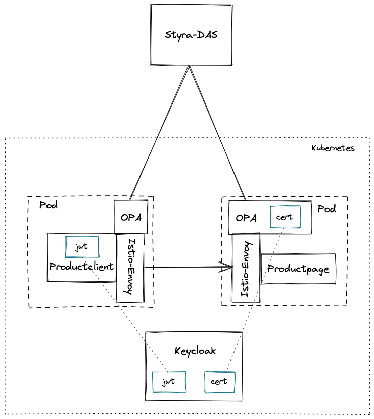
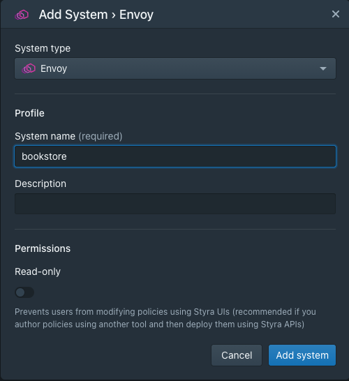
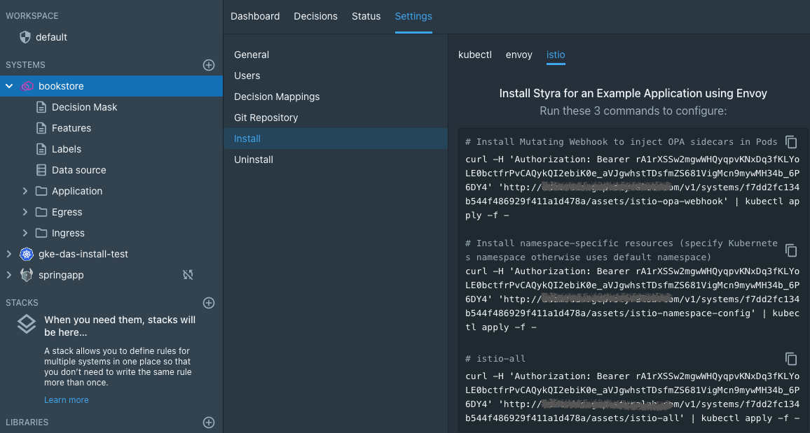
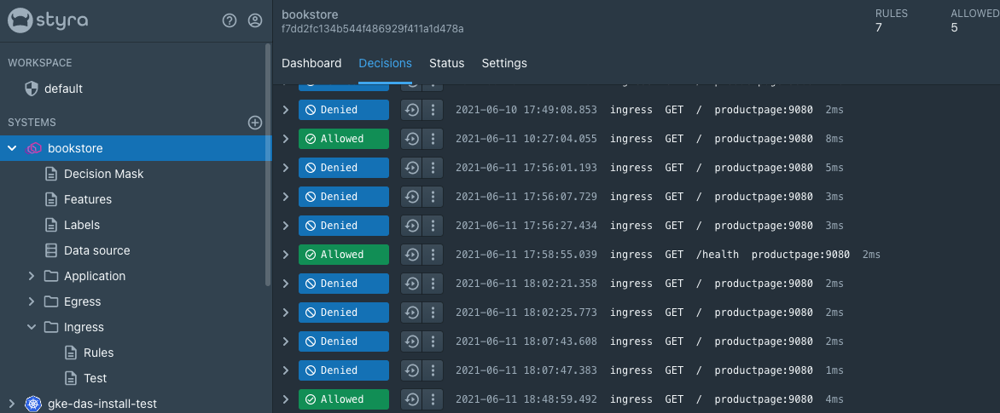

# Service to service authorization using Keycloak generated JWT tokens and Istio-OPA integration

This example demonstrates the usage of JWT tokens for service to service authorization. Keycloak will be used to issue the tokens while OPA is used to verify them.

I'm using the Bookstore application from the Istio bookinfo sample application, but you can replace that with any http service.

The client that is calling the bookinfo is a simple container running `curl` to access the bookinfo productpage service.



# Setup

These are the high-level steps needed to set up the sample. More details follow below.

1. Get a Kubernetes cluster
1. Install Istio
1. Install Keycloak
1. Configure the Realm, Client and User in Keycloak
1. Create a System for Istio-Envoy in Styra DAS
1. Install Opa-Istio integration
1. Create the bookstore namespace and enable Istio and OPA injection
1. Install the bookstore application
1. Setup authorization rules in Styra DAS with JWKS verification of the JWT

## Detailed steps

### 1. Get a Kubernetes cluster

Beg, borrow or steal a Kubernetes cluster. Anything will work from minikube to cloud-provider managed ones. I used GKE 1.19.

### 2. Install Istio

The setup is tested using the 1.10.0 version of Istio. I don't recommend using the built-in Istio functionality of GKE as that installs 
a version of Istio that is too old for the OPA integration to work.

You can use the following quickstart guide to install Istio: https://istio.io/latest/docs/setup/getting-started/

Note: I used the `demo` profile.

### 3. Install Keycloak

A very simple deployment configuration for Keycloak can be found in `keycloak-deployment.yaml`. This will run Keycloak in a single instance
with an embedded database. It doesn't ensure the database is persisted when the Pod is killed.

### 4. Configure the Realm, Client and User in Keycloak 

You can either configure the Keycloak setting using the admin console or use the following CLI commands. These should be executed inside the
running Keycloak container, so start with exec-ing into the container. Replace the Pod's name with the actual one from your cluster.

`kubectl exec -ti keycloak-xyz -- bash`

Once you're in run the following commands:

```bash
# Make sure kcadm.sh is on our path.
export PATH=/opt/jboss/keycloak/bin:$PATH

# Log in to the local server.
kcadm.sh config credentials --server http://localhost:8080/auth --realm master --user admin --password admin

# Create the bookstore Realm
kcadm.sh create realms -s realm=bookstore -s enabled=true -o

# Enable non-ssl access to the bookstore realm for our sampleclient. You skip this step if you have a proper Keycloak setup with SSL certificate configured.
kcadm.sh update realms/bookstore -s sslRequired=NONE

# Create the Client for the testclient application
kcadm.sh create clients -r bookstore -s clientId=testclient -s enabled=true -s clientAuthenticatorType=client-secret -s directAccessGrantsEnabled=true -s secret=myclientsecret

# Create the User for the testclient application with a password
kcadm.sh create users -r bookstore -s username=testclient -s enabled=true
kcadm.sh set-password -r bookstore --username testclient --new-password testclientpwd

# If you want to use a generated client secret you can run this command to create one (instead of hardcoding myclientsecret)
# generate client secret: kcadm.sh create clients/508cf5e9-ea65-47dd-85d5-06d314cff6c3/client-secret

# If you want to access the admin console without using https, you can disable ssl on the master realm
# kcadm.sh update realms/master -s sslRequired=NONE
```

You can choose to expose Keycloak to outside of the cluster using an Ingress. I wont conver that here as it's not
necessary for this tutorial and works differently depending on your cloud provider and DNS/SSL configuration.

To verify if Keycloak is working properly run these two commands. I will be using my own swissarmyknife image
as it has both curl and jq. You can use any other Docker image that has both tools.

Copy-paste the JWKS from your console somewhere as we'll be using it in a rule in Styra DAS

```bash
# run the swissarmyknife container on the cluster
k run -ti --image=adamsandor83/swissarmyknife verify

# verify creation of the JWT and store it for later
curl -L -X POST 'http://keycloak.keycloak:8080/auth/realms/bookstore/protocol/openid-connect/token' \
-H 'Content-Type: application/x-www-form-urlencoded' \
--data-urlencode 'client_id=testclient' \
--data-urlencode 'grant_type=password' \
--data-urlencode 'client_secret=myclientsecret' \
--data-urlencode 'scope=openid' \
--data-urlencode 'username=testclient' \
--data-urlencode 'password=testclientpwd' | jq

# Verify download of JWKS for certificate validation. Store the output of this command for later
curl 'http://keycloak.keycloak:8080/auth/realms/bookstore/protocol/openid-connect/certs' | jq
```

Both commands should return valid JSON structures with the [JWT](https://auth0.com/docs/tokens/json-web-tokens) and [JWKS](https://auth0.com/docs/tokens/json-web-tokens/json-web-key-sets) inside.

### 5. Create a System for Istio-Envoy in Styra DAS

Note: This part of the tutorial uses Styra DAS, which is a commercial product and the free version doesn't support
the Envoy System. Get in touch with Styra for a trial of Styra DAS.

The System in Styra DAS will be controlling the OPA instances performing authorization of requests going through
the Istio Envoy sidecars. Any rules we define in the System will be synced to all OPA instances. The System
will also give us the installation instructions for getting OPA sidecar injection working on the cluster.

Using the DAS UI create a new System of type Envoy called bookstore:



### 6. Install OPA-Istio integration

Next navigate to Settings / Install / Istio and execute the commands listed there.



This will install create the `styra-system` namespace and install the Styra local control plane. Any namespaces
marked with the `opa-istio-injection: enabled` label will get an OPA sidecar injected into all pods next to the
Istio Envoy sidecar.

### 7. Create the bookstore namespace and enable Istio and OPA injection

Create a namespace called `bookstore` with the Istio and OPA injection enabled:

```yaml
apiVersion: v1
kind: Namespace
metadata:
  name: bookstore
  labels:
    istio-injection: enabled
    opa-istio-injection: enabled
```

### 8. Install the bookstore application

```bash
kubectl apply -n bookstore -f https://raw.githubusercontent.com/istio/istio/release-1.10/samples/bookinfo/platform/kube/bookinfo.yaml
```

You can verify if the installation succeeded by listing the pods in the namespace. Each pod should have 3 containers - the application,
the Istio-Envoy sidecar and the OPA sidecar.

```bash
kubectl get pods -n bookstore
NAME                             READY   STATUS    RESTARTS   AGE
details-v1-786d46874b-vz2ds      3/3     Running   0          24h
productpage-v1-7596664bb-rz6sp   3/3     Running   0          24h
ratings-v1-b6994bb9-jbckq        3/3     Running   0          24h
reviews-v1-fd59b9b54-pzq7l       3/3     Running   0          24h
reviews-v2-588f666ddb-ffbkq      3/3     Running   0          24h
reviews-v3-5f59c566d6-mfqqc      3/3     Running   0          24h
```

### 9. Setup authorization rules in Styra DAS with JWKS verification of the JWT

Edit the Ingress rules in your bookstore System in Styra DAS to look like this. Also delete any other sample rules that were created
for the system.

```rego
package policy["com.styra.envoy.ingress"].rules.rules

import input.attributes.request.http as http_request

default allow = false

# Replace with your own JWKS received from curl command in setup step 4.
jwks := `{"keys":[{"kid":"3kFg4hts8TUz6PDnfBXEFNRyQAO6U03h3Q2QMsIV9 ... g2tZbs","x5t#S256":"KonS4nIk_4cYaiCW9aGkKNv8bxpCiY5L3IoNj1rUqLE"}]}`

token = {"valid": valid, "payload": payload} {
    # We expect a header in the "Authorization: Bearer <JWT>" format
    [_, encoded] := split(http_request.headers.authorization, " ")

    # validate the JWT using the JWKS
    valid := io.jwt.verify_rs256(encoded, jwks)

    # Decode the JWT
    [_, payload, _] := io.jwt.decode(encoded)
}

# allow all healthchecks
allow {
    startswith(http_request.path, "/health")
}

# if it's not a healthcheck only allow requests with a valid JWT
allow {
    token.valid
}
```

After each rule change push the Publish button to signal to DAS that it can sync the rule bundle to the OPA agents.

## Let's make some requests

At this point we are ready to run our "application" to see how it interacts with the rules deployed in Styra DAS. To 
keep things simple and transparent we will just run commands from a container running on the cluster. 

Note: Set kubectl to use the `bookstore` namespace from here.

```bash
# we will use the same swissarmyknife image to sim
kubectl run -ti --image=adamsandor83/swissarmyknife clientapp

# Let's test a request with an invalid token. You should receive a 403 Forbidden error as Envoy delegates authorization
# to OPA and OPA rejects the request.
curl -v -H "Authorization: Bearer XYZ" http://productpage:9080

# We can also check if our healthcheck rule works. Note that we configured the Ingress rules in Styra DAS to always
# allow requests to paths starting with "/health"
curl -v -H "Authorization: Bearer XYZ" http://productpage:9080/health

# You can navigate to the Decisions page under the bookstore System in Styra DAS to see the decision log of the allowed 
# and rejected requests. Note that there will be a lot of healthcheck requests there and it take a few seconds for 
# the local OPA agent to sync the logs to DAS.

# Now let's make a request with the valid JWT...

# Let's fetch the JWT from Keycloak.
# This request will not be blocked by OPA because OPA injection is not enabled on the keycloak namespace.
curl -L -X POST 'http://keycloak.keycloak:8080/auth/realms/bookstore/protocol/openid-connect/token' \
-H 'Content-Type: application/x-www-form-urlencoded' \
--data-urlencode 'client_id=testclient' \
--data-urlencode 'grant_type=password' \
--data-urlencode 'client_secret=myclientsecret' \
--data-urlencode 'scope=openid' \
--data-urlencode 'username=testclient' \
--data-urlencode 'password=testclientpwd' > jwt.token

TOKEN=$(cat jwt.token | jq -r .access_token)

curl -H "Authorization: Bearer ${TOKEN}" http://productpage:9080
# you should see the html output from the productpage service now
```

When you navigate to the Decisions page you should also see the allowed and denied decisions. From here on you can go ahead and play with the rules.
Don't forget to publish your rules after changing them and wait a few seconds for the changes to sync.



# Next steps

Here are some ideas for where you can go from here

* Check out the debugging and validation features of Styra DAS. TODO: public link here
* Make Styra DAS pull the JKWS periodically from Keycloak or run a service that pushes it to DAS to keep the two in sync.

